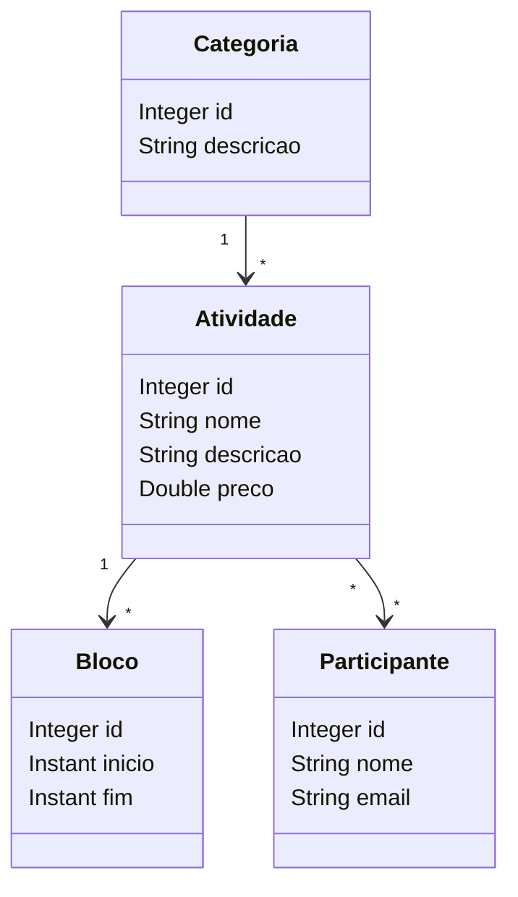

# EVENTO

Sistema de gerenciamento de eventos desenvolvido com Java, Spring Boot e JPA/Hibernate.

## Diagrama de Classes




## Sobre o Projeto

EVENTO é uma aplicação que modela o domínio de um sistema de eventos, permitindo o gerenciamento de atividades, categorias, participantes e cronogramas.

O projeto foi desenvolvido com foco no aprendizado de modelagem de entidades utilizando JPA/Hibernate, incluindo relacionamentos **One-to-Many**, **Many-to-One** e **Many-to-Many**.

##  Modelo de Domínio

O sistema é composto pelas seguintes entidades:

### Categoria

Representa a classificação de uma atividade.

Exemplos:

- Curso
- Oficina
- Palestra

### Atividade

Representa uma atividade disponível em um evento.

**Atributos:**

- Nome
- Descrição
- Preço

**Relacionamentos:**

- Pertence a uma categoria
- Possui vários blocos de horário
- Possui vários participantes

### Bloco

Representa um período de execução de uma atividade.

**Atributos:**

- Data/hora de início
- Data/hora de término

**Relacionamentos:**

- Pertence a uma atividade

### Participante

Representa uma pessoa inscrita em atividades.

**Atributos:**

- Nome
- E-mail

**Relacionamentos:**

- Pode participar de várias atividades

## 🔗 Relacionamentos

```text
Categoria (1) ──────── (N) Atividade

Atividade (1) ──────── (N) Bloco

Atividade (N) ──────── (N) Participante
```

## Tecnologias Utilizadas

- Java
- Spring Boot
- Spring Data JPA
- Hibernate
- Maven
- Jakarta Persistence API (JPA)

## Estrutura do Projeto

```text
src/
└── main/
    └── java/
        └── com/
            └── semicolon/
                └── demo/
                    └── entities/
                        ├── Atividade.java
                        ├── Bloco.java
                        ├── Categoria.java
                        └── Participante.java
```

## ▶️ Executando o Projeto

### Pré-requisitos

- Java 17 ou superior
- Maven 3.8+

### Clone o repositório

```bash
git clone https://github.com/Medeiroshenrique/EVENTO.git
```

### Entre no diretório

```bash
cd EVENTO
```

### Execute a aplicação

```bash
./mvnw spring-boot:run
```

ou

```bash
mvn spring-boot:run
```

## Conceitos Praticados

- Modelagem orientada a objetos
- Persistência de dados com JPA
- Hibernate ORM
- Relacionamentos entre entidades
- Chaves primárias e estrangeiras
- Tabelas de associação (Many-to-Many)
- Boas práticas de mapeamento ORM

## Objetivo Educacional

Este projeto foi desenvolvido para praticar conceitos de:

- Java Orientado a Objetos
- Spring Boot
- JPA/Hibernate
- Banco de Dados Relacional
- Modelagem de Sistemas

## Autor

**Henrique Medeiros**

GitHub: https://github.com/Medeiroshenrique

---

 -> Se este projeto foi útil para você, considere deixar uma estrela no repositório.
